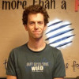
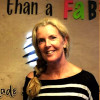
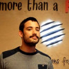
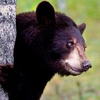

# Introduction

THE openfab manual. Will be the source of all knowledge in the lab.

## but first,

**have a look at this awesome community:**  
_All creatures welcome. Just be excellent to each other._  
`memebers, we respect your anonymity` 😉

              

   

      

  

 

## Bienvenue,

_Hello, welcome on Board! We are glad to see you here :\)_

**@Openfab**  
We want you to get better at making stuff.  
More than a fablab, **more than a tool box**, we have a place \(tailor made for you\) where you can make better, because **we do it together**.

**Level Up yourself**, within a community and peer to peer learning.  
Through Human-Focused Design and mentorship, you will choose what to learn, how to make and be free to share your own experience.  
Here, you can develop your technical skills and evolve your human abilities in a **friendly environment**.

Thanks to **a community of “makers who make”**, who produce and earn a living in a sharing economy.  
We are building a living fablab, more sustainable and resilient to embrace change.

> “You never change things by fighting the existing reality. To change something, build a new model that makes the existing model obsolete.”  
> — _Buckminster Fuller_

## How

**OpenFab n'est pas un shop**, pas une entreprise mais une association, c'est **un collectif de makers** qui mutualisent un espace, levelup leurs compétences grâce à l'aide de la communauté.  
Ils peuvent ensuite choisir de partager leur savoir-faires en animant des workshops ou en fournissant un service.

Nous partageons mais tout à un prix  

Pas d'employé, une gestion communautaire et les montants demandés se veulent juste et ont pour objectif de financer les charges communes \(le loyer, les machines, la gestion et le développement d'activités\).

## Pour rejoindre la communauté

_Want to join?_

You’re part of the makers Nation!  
At Openfab, we believe in the idea of an makers Nation, as explained here and here. Without any borders and with a shared language, \(yes, English/github\), we’re convinced that almost every country holds people who are citizens of makers Nation.  
While there are probably more people from the makers Nation in the US, its citizens are everywhere, in every fablab, makerspace, biolab,... And this represents a huge opportunity for you to levelup.

So bring your skills’ real value to the table, not just your nationality.

**3 cas de figure.**

1. Tu as pour habitude de relever les defis, chercher après tes solutions. Pas besoin qu'on te prenne par la main, **tu sais ce que tu as besoin** mais tu as un projet en tête mais il te manque place, outils ou simplement une communauté avec qui parler de ton projet. That's cool. Le fablab est parfais pour toi. [continue ici](community/fablab.md)
2. Chercher par toi même te saoule, mais tu aimerai découvrir des nouvelles technologies et **tu préfère être accompagné dans la réalisation** d'un projet qui fonctionne. Génial, on a un paquet de membres qui aime partager leur passion. [les workshops seront parfait pour toi](./#Workshops)  
3. 2 bras gauches, pas le tps ou simplement **envie de supporter des artisans locaux**. On peut s'occuper de certains jobs pour vous.  

   Aujourd'hui, la demande la plus courante est [l'enseigne personnalisée](./#Services).

### fablab

Une inscription à l'ASBL et un parcours d'apprentissage.  
5 niveaux de membres.

1. Introduction - utilisation du lab sans participer \(voir tarifs\)
2. Onboarding - envie de participer, cela passe par une étape d'apprentissage solo.
3. Scaffolding - du projet solo aux projets de groupe. Accès aux teams.
4. TeamWork - niveau pro, contributeur au projet, accès à la gestion de team et prestations.
5. Exploration - master collaboration, connecting with communities abroad, discover new opportunies and making it available for others.

Passport maker, local currency, human-Focused design, method Agile and github is some of the ingredients of the recipe.

### Workshops

zoup, yoyoyoyoyolo

### Services

Encollage et peinture des tranches  

Logo en bois, découpé laser, encollé, peint et vernis selon plans du client.

## Prix: ~550€ tvac  **-non posé ^^'-**

